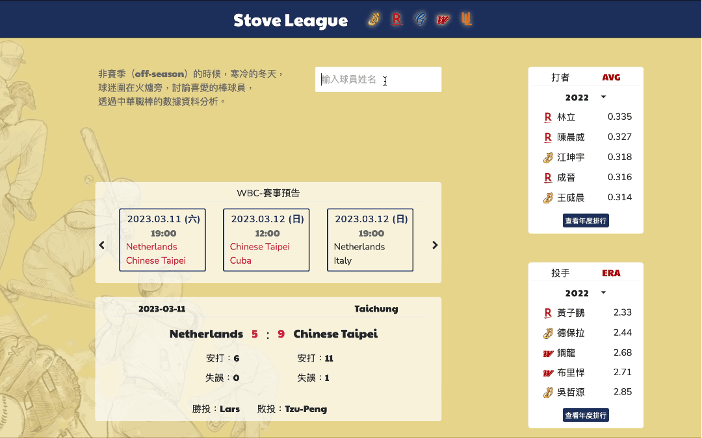
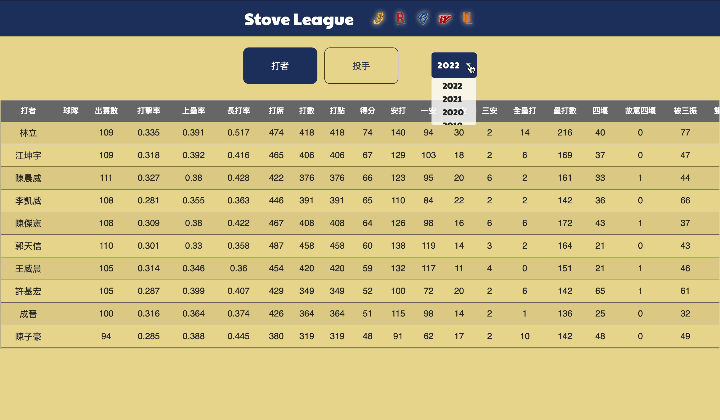
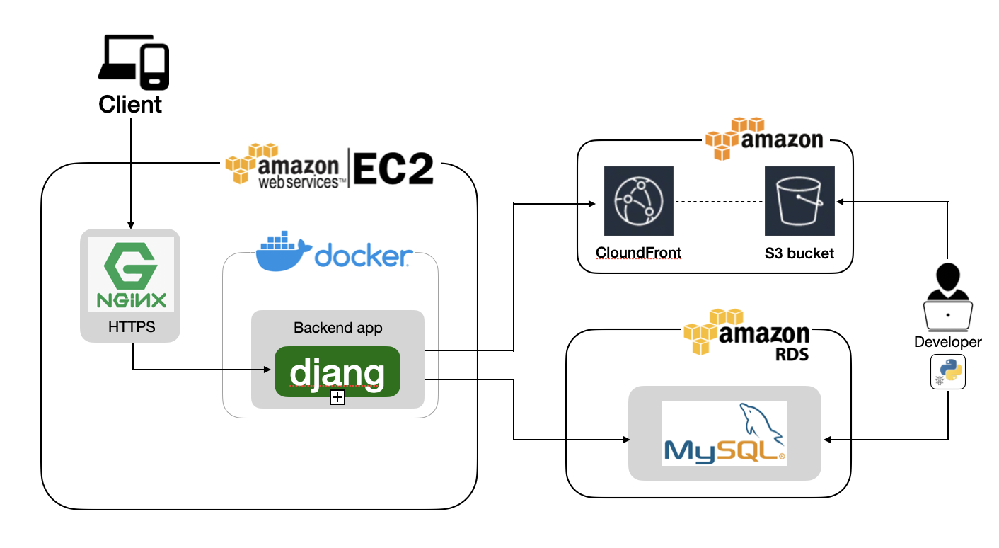
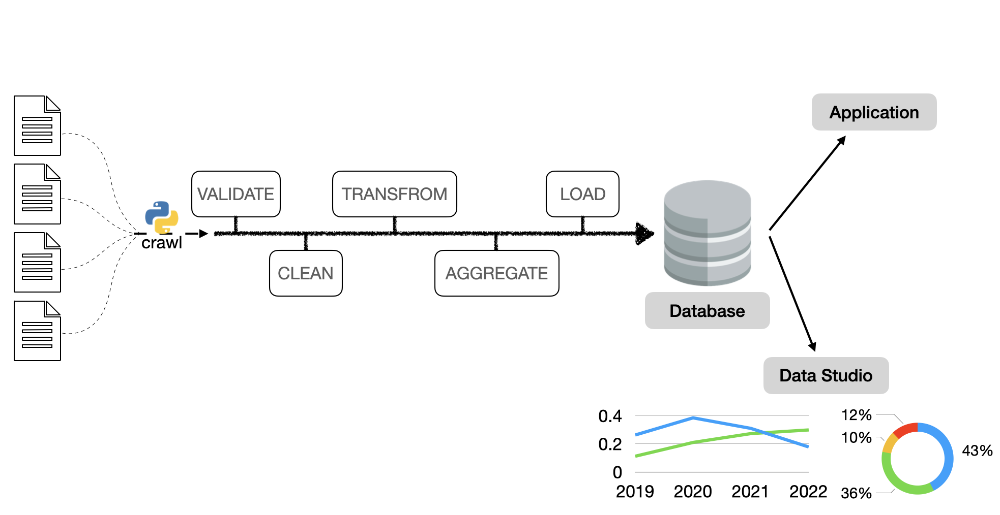
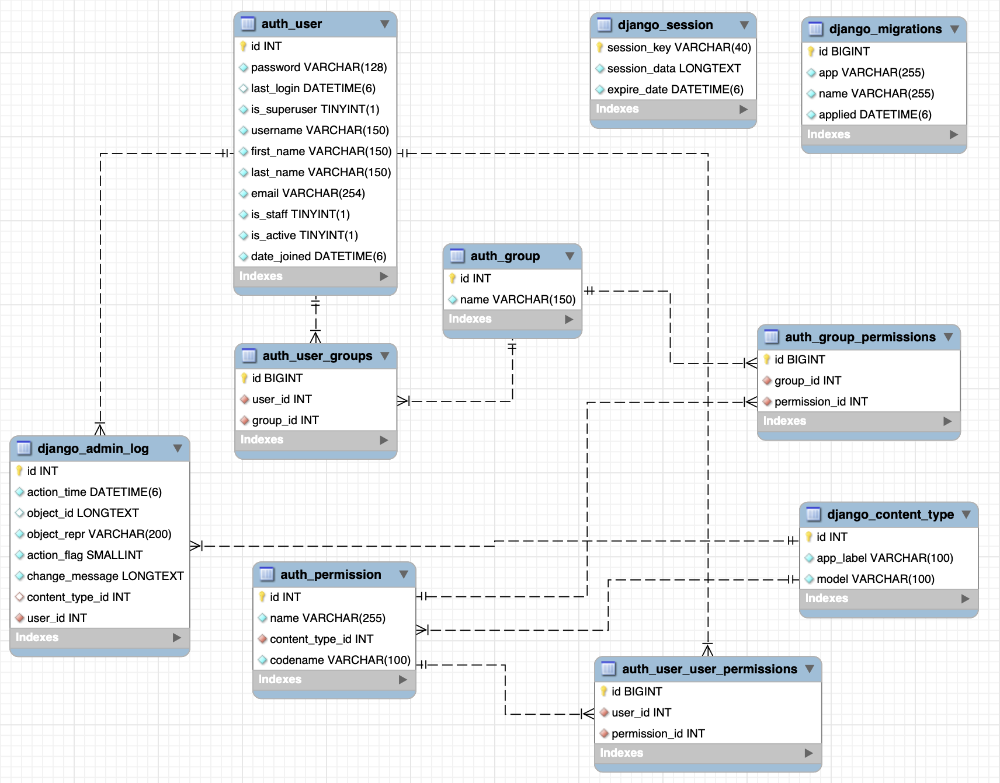
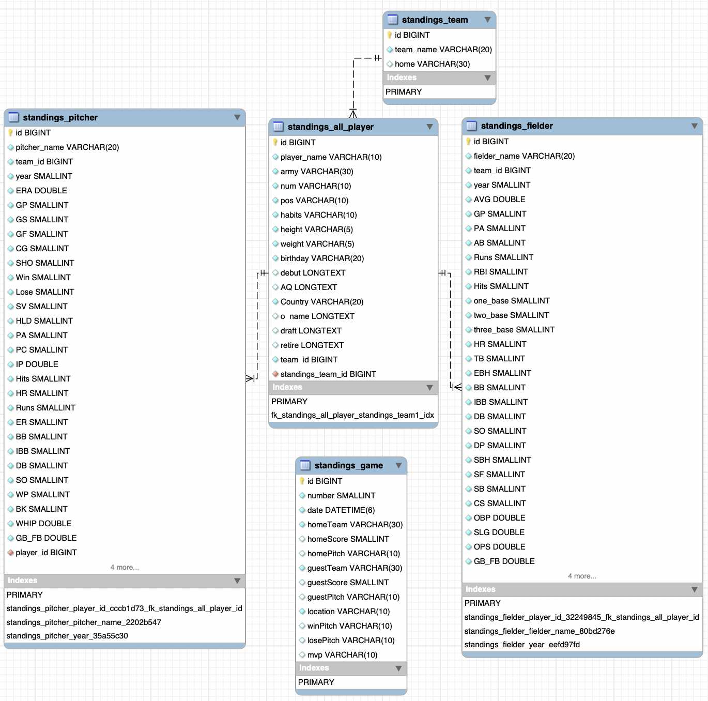

# StoveLeague
以中華職棒官網作為資料根據、爬取，建置提供臺灣職業棒球選手資料圖表化，易於比較選手間的數值，定時更新官網數據提供賽事預告以及比賽數據結果。

## Demo  
player comparison  
- Schedule data updates using crontab.
  
 
scending 

[Backend Technique](#backend-technique)  
- [Environment](#environment)  
- [Database](#database)  
- [Cloud Services](#cloud-services)  
- [Version Control](#version-control)  
- [Development Tools](#development-tools)  

[Architecture](#architecture)  
[Data Pipeline](#data-pipeline)  

## Backend Technique

### Environment
- Use **django** as server framework. 
  - MVC  
  - ORM  
  - CSRF 
- Use **Python** & urllib package for web scraping.  
  - crontab  
  - dotenv 
- Adapt AJAX which sends requests to the **RESTful API**-designed backend.
### Database  
- Store web scraping data into AWS RDS **MySQL**.Using the index and normalized MySQL to improve query efficiency. 
### Cloud Services  
- AWS EC2  
- AWS RDS  
- Store files in **AWS S3** and using **CloudFront** to accelerate file access. 
### Version Control
- Git / GitHub  
### Development Tools  
- Deploy the website by **Docker**.
- Use **Nginx** reverse proxy to establish a more secure HTTPS connection.   
- SSL 
- Domain Name System
## Frontend Technique  
- HTML  
- CSS  
- JS    
- Bootstrap  
- Chart.js  

## Architecture

## Data Pipeline 處理資料流程示意圖 
  

## Database Schema  
  
